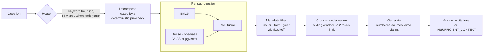

# finhelm

**Question answering over US bank SEC filings that shows its work — and an evaluation
harness honest enough to say when it doesn't.**

Every answer is built only from passages retrieved out of real SEC filings, FOMC
statements and CFPB consumer complaints, and every passage is shown to the reader with a
link to the source document. When the retrieved passages don't contain the answer, the
system says so instead of guessing.

> **Status: Days 1–3 of 5 complete.** The service, the observability, the five-service
> container stack, the CI gate and the Kubernetes manifests all run and are verified
> against the real thing. Not yet done: the consumer-complaint analytics module, a public
> deployment, and the final full evaluation. **There is no live demo link, because nothing
> is deployed** — the Cloud Run and Space configs are written and unexecuted, and they say
> so. Sections below flag what is measured against what is merely written.

---

## The business question

A credit-risk analyst at a bank needs to answer things like *"how do Capital One and
Synchrony each describe credit normalization in their most recent 10-Ks?"*

SQL cannot answer that. The fact lives in a paragraph of Item 7 MD&A, phrased differently
by each filer, in a document nobody has parsed into columns. The existing options are
full-text search — which returns the right document and leaves you to read forty pages —
or an LLM, which will answer fluently and sometimes invent the number.

This system takes the third path: retrieve the specific passages, answer only from them,
cite each claim to a source the reader can open, and refuse when the evidence isn't there.
The refusal is the part that makes it usable in finance, and it is measured as carefully
as the answers.

---

## Results

Measured on 202 questions and 248 gold spans. The headline run is
`semantic-hybrid-rr-ctx-ag-winK16`.

| Metric | Value | What it means |
|---|---|---|
| **recall@16 (macro)** | **0.7403** [0.682, 0.796] | Share of needed evidence that reaches the model |
| recall@16 (micro) | 0.7016 [0.642, 0.755] | Same, weighted by span rather than by question |
| — single-span questions | 0.8246 (n=114) | |
| — multi-span questions | 0.5970 (n=67) | The hard tier, and the honest one |
| MRR | 0.4628 | |
| **citation validity** | **1.0000** | No answer ever cited a source that wasn't supplied |
| abstention recall | 0.8571 | Of questions with no answer in the corpus, how many it declined |
| over-refusal rate | 0.1160 | Of answerable questions, how many it wrongly declined |
| route accuracy | 0.9485 | |
| cost / query | $0.0340 | |
| p50 latency | 24.7 s | Agentic path, cold cache, laptop CPU |

Both macro and micro recall are reported because they diverge once span counts are
unequal (0.740 vs 0.702), and quoting only the flattering one would be a choice.

### How it got there

Each step is a paired comparison on the same golden set, not a re-tuned rerun.

| Change | recall@16 | Δ |
|---|---|---|
| Day 2 close | 0.3890 | — |
| Golden set expanded to 202 questions | 0.4171 | baseline reset |
| Contextual chunk headers | 0.4475 | +0.0304 |
| `bge-base` embeddings (from `bge-small`) | 0.4917 | +0.0373 on multi-span |
| Issuer/form metadata filtering | 0.5387 | +0.0470 |
| Sliding-window cross-encoder reranking | 0.6160 | +0.0608 |
| Context budget k=16 | **0.7403** | +0.1243 |

### What was measured and rejected

Kept here because negative results are most of the work and disappear from write-ups:

- **Pool widening** — final recall *falls* as the candidate pool grows (0.712 → 0.652 at
  width 50). Widening only helps if the scorer can use it.
- **`bge-reranker-large`** — indistinguishable from `base` once windowing is on: 9 wins,
  11 losses, 161 of 181 questions bit-identical. Verified on a T4 against locally
  computed scores that reproduced to 0.00000.
- **Per-sub-question rerank budgets** — loses on every tier. The isolation test that
  motivated it was invalid: it gave each sub-question its own top-5, measuring context
  budget rather than query shape.
- **Interleave fusion** (+0.0028) and **a different RRF constant** (+0.017, simulation
  only) — inside the noise band.

An oracle reranker at width 20 would score **0.9185**, so roughly **+0.10 of headroom sits
in the scoring stage**, not in retrieval width or in model scale.

---

## Architecture



**Corpus:** 10 institutions — AXP, BAC, C, COF, DFS, GS, JPM, SYF, USB, WFC — as 24,650
filing chunks plus 18,498 CFPB complaint chunks.

**Serving:** FastAPI, a Streamlit demo, OpenTelemetry spans exported to Jaeger, and MLflow
tracking. Five compose services, three of them the same image so the MLflow server can
never be a different version than the client that wrote its store.

---

## Evaluation methodology

The part of this project that took the longest and is worth the most.

**Ground truth is anchored on `(doc_id, snippet)`, not on chunk ids.** A chunk id is not
portable across chunking strategies, so a golden set keyed on one cannot compare them. A
retrieved chunk counts as a hit when the document matches exactly, it shares a contiguous
10-word run with the gold snippet, and its figures do not contradict the gold span's.

**Retrievability ceiling is 1.0000** for all three chunking strategies — every gold span
is reachable by *some* chunk. Low recall is therefore genuine retrieval failure, not a
metric artifact. That check is what makes the recall number mean anything.

**Golden set: 202 questions, 248 gold spans.** Composition: 114 single-hop, 42 multi-hop,
25 temporal, 13 unanswerable-but-in-domain, 8 out-of-scope. Provenance, stated exactly:
21 hand-written (all the negatives), 127 LLM-drafted and machine-verified, and **54
LLM-drafted and still pending human review**. The negatives are hand-written because
models are bad at inventing plausible-but-absent facts, and those are the highest-value
items in the file.

**Negatives are scored separately.** Faithfulness against an empty ground truth is
meaningless, so the 21 negatives are scored by the abstention pair instead. Reporting both
directions matters: a system that refuses everything scores perfectly on one and
catastrophically on the other.

**The judge is a different model family from the generator** (Gemini judging Claude),
enforced in `Config.__post_init__`, because same-family judging produces self-preference
bias.

**Comparisons use paired bootstrap over questions, not point estimates.** This is the
single most important thing learned here: with 202 questions the paired sd is such that
the resolvable effect is about 0.12, and most interventions land near +0.02. An
18-cell ranking built from point estimates was noise with an ordering printed on it.

### The CI gate

Two tiers, split by cost rather than by importance:

| | runs on | cost | what it gates |
|---|---|---|---|
| `fast` | every push | $0 | unit tests, then a real retrieval eval |
| `judged` | pull requests | cents | DeepEval smoke suite, regression vs baseline |

The free tier runs a genuine retrieval eval, not a re-read of recorded numbers, against a
committed 1,903-chunk fixture carved out of the real corpus (`scripts/make_ci_fixture.py`
selects gold-bearing chunks using the metric's own `is_hit`, so the fixture cannot
disagree with the metric that reads it). **Its floor of 0.80 against a measured 0.8667 is
a tripwire, not a quality number** — retrieval against 1,903 chunks is far easier than
against 24,650.

The gate is built to be unable to pass quietly:

- an **unknown metric name is a failure**, not a pass. The obvious threshold to write here
  is `recall_at_5`, which this system does not produce — it serves top-k=16 — so a lenient
  lookup would sit green forever while reading exactly like a gate;
- a metric present but `None` fails, because "not measured" is not "passed";
- `--fail-on-fallback` catches a missing index being silently substituted, which would
  mean the gate measured a different system;
- `--deterministic-only` asserts `llm.USAGE` is empty afterwards rather than trusting the
  flags meant to arrange it — decomposition calls a model and catches every exception, so
  a keyless run would not error, it would quietly stop splitting multi-hop questions.

**Proof the gate is real rather than decorative.** The same command, with the context
budget cut from 16 to 2 and nothing else changed:

| config | recall@16 | multi-span | single-span | gate |
|---|---|---|---|---|
| `top_k_context=16` (shipped) | 0.8667 | 0.8125 | 0.9286 | **passes**, exit 0 |
| `top_k_context=2` (broken) | 0.6667 | **0.4375** | 0.9286 | **fails**, exit 1 |

```
GATE FAILED
  x recall_at_16 = 0.6667 is below the floor of 0.8000
```

The damage lands where it should: single-span recall is untouched and multi-span nearly
halves, because a smaller context budget can only hurt questions that need more than one
passage. A gate that fired without that pattern would be measuring something else.

---

## Quickstart

```bash
git clone https://github.com/omvyas77/finhelm && cd finhelm
cp .env.example .env    # add ANTHROPIC_API_KEY and GOOGLE_API_KEY
docker compose up -d
```

Then: UI at `localhost:8501`, API at `localhost:8000/docs`, traces at `localhost:16686`,
MLflow at `localhost:5001`.

The indexes are build artifacts and are not in the repo (961 MB). Build them with
`scripts/build_index.py`, or point `FINHELM_DATA_DIR` at the committed CI fixture in
`data/ci` to run against the small corpus immediately.

**On an 8 GB machine, give Docker at least 5 GB.** A single `/ask` peaks at 2.7 GiB: both
models resident plus the FAISS index and its metadata.

---

## Scaling

The `VectorStore` protocol means the backend is a config change, not a rewrite. A
benchmark against Postgres + pgvector on identical vectors found latency a wash at this
size (p50 1.6 ms FAISS vs 1.7 ms pgvector) — the real difference is filtering. FAISS has
no `WHERE` clause, so it over-fetches and post-filters; at 0.1% selectivity it returns
**0 results where 26 matching rows exist**, silently. Postgres applies the predicate in
the query.

**Kubernetes manifests are in [`deploy/k8s/`](deploy/k8s/)** — Deployment, Service, HPA,
ConfigMap, Secret, PVC and PDB, validated against a local `kind` cluster and torn down.
They are not what runs the demo. For single-user traffic a cluster is unjustified cost and
operational overhead; they exist so the scaling path is concrete rather than hypothetical.

What that validation actually established, and one thing it did not: all seven manifests
were accepted by a real API server, the Deployment reached `Available 1/1`, the PVC bound,
`securityContext` applied as `uid=10001` non-root, and the Service's EndpointSlice
selected the pod. The container itself was **not** exercised there — the image is 5.76 GB
and was never pushed to a registry, so the structural check ran on `busybox`. The compose
stack is what verifies the real container end to end.

The finding worth keeping is a silent one. `ReadOnlyMany` is correct for production, since
every replica reads the same immutable index; kind's default StorageClass cannot serve it,
and the failure gives you nothing to go on — the PVC stays `Pending` reporting only
"waiting for first consumer", pods stay `Pending`, and **no event on either object ever
mentions the access mode.** Changing that one field to `ReadWriteOnce` bound it in six
seconds.

**Cloud Run and Hugging Face Space configs** are in [`deploy/cloudrun/`](deploy/cloudrun/)
and [`deploy/hf-space/`](deploy/hf-space/) — and **neither is deployed.** There is no GCP
project or Space yet, so no live URL exists and the cold-start figures in those READMEs
are derived from local measurement rather than observed. The named risk is that a 5.76 GB
image is large for scale-to-zero; if cold pulls prove too slow, the honest fixes are a
serving-only image without the eval harness, or paying for `minScale: 1`.

Still to build: incremental re-indexing as new filings land, and a cache keyed on
question + config.

---

## Limitations

Stated plainly, because they are the first thing a careful reader will look for.

- **The corpus is 10 institutions.** Anything outside them is out of scope by
  construction, and the system is expected to refuse.
- **54 of 202 golden questions are LLM-drafted and not yet human-reviewed.** The other
  148 are hand-written or machine-verified. The headline number includes all 202.
- **About half the multi-span questions yoke arbitrary facts** — two gold snippets sharing
  under 10% of their content. That is a property of how the set was generated, and it
  partly explains the 0.597 multi-span recall.
- **One embedding model was evaluated end to end.** `bge-large` was never indexed.
- **Complaint analysis is ecological.** Patterns across CFPB narratives are aggregate and
  cannot support claims about individual cases.
- **Section parsing falls back on a minority of filings**, so some chunks carry a
  `full_document` section label rather than a real item.
- **q055 is a deliberate failing test.** The system fabricates an executive's compensation
  and cites a real 8-K cover page, which scores 1.0 on citation validity — a case where
  the metric is satisfied and the answer is wrong. It is marked `xfail(strict=True)` so
  that fixing it turns the gate loudly XPASS rather than quietly green.

A running log of every failure and its mechanism is in
[`notes/failures.md`](notes/failures.md).

---

## License

MIT — see [LICENSE](LICENSE).
