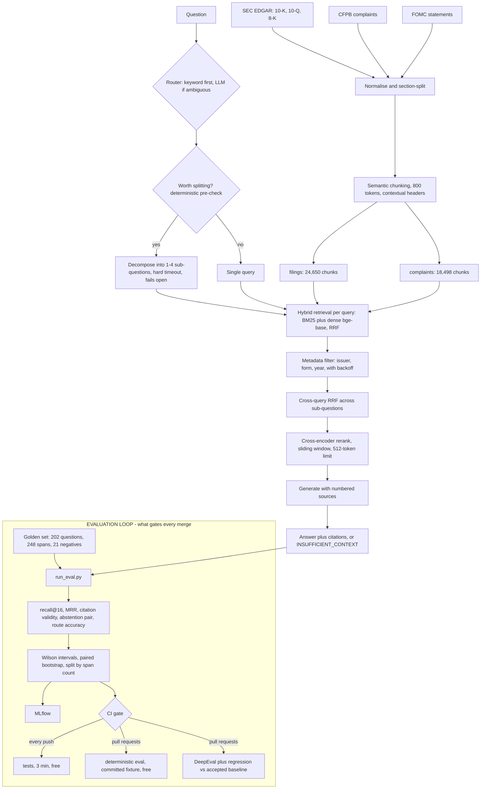

# Method

The detail behind the [README](../README.md). Every figure here comes from one frozen run —
[`semantic-hybrid-rr-ctx-ag-final`](../evals/results/semantic-hybrid-rr-ctx-ag-final.json),
202 questions, 248 gold spans. Nothing is hand-edited, and a test asserts these files
cannot quote a number that run did not produce.

## Results

| Metric | Value | What it means |
|---|---|---|
| **recall@16 (macro)** | **0.7403** [0.682, 0.793] | Share of needed evidence that reaches the model |
| recall@16 (micro) | 0.7016 [0.642, 0.755] | Same, weighted by span rather than by question |
| — single-span questions | 0.8246 (n=114) | |
| — multi-span questions | 0.5970 (n=67) | The hard tier, and the honest one |
| MRR | 0.4633 | |
| **citation validity** | **1.0000** | No answer cited a source that wasn't supplied |
| abstention recall | 0.9048 | Of questions with no answer, how many it declined |
| over-refusal rate | 0.1160 | Of answerable questions, how many it wrongly declined |
| citation density | 1.0420 | Citations per substantive claim |
| route accuracy | 0.9485 | |
| cost / query | $0.0339 | |
| p50 latency | 32.3 s | Agentic path, cold cache, laptop CPU |

Macro and micro are both here because they diverge once span counts are unequal, and
quoting only the flattering one would be a choice. **Macro is the headline everywhere in
this project**; micro sits beside it and never replaces it.

The retrieval half of this run is bit-identical to one from two weeks earlier — recall@16,
both span tiers and micro recall all reproduce to four decimals. That matters more than the
value itself: it means the ablation was comparing configurations rather than run-to-run
drift.

Two figures moved between those runs and neither is a finding. MRR shifted +0.0005 while
recall did not, which is what a rank permutation *inside* the top 16 looks like — recall
asks whether a span is in the set, MRR asks where. Abstention recall went 0.8571 to 0.9048,
which is one question of 21 negatives changing its mind. At n=21 a single flip is 4.8
points.

### Citation validity is 1.0 and that is not as good as it sounds

Every citation marker points at a source that was actually supplied. It is still possible
to fabricate: q055 invents an executive's compensation and cites a real 8-K cover page,
which satisfies the metric completely. The marker is valid; the page just doesn't contain
the claim. See the limitations below.

## Architecture

The serving path is the top two thirds. The evaluation loop at the bottom is the part worth
looking at — it is what turns the rest from a demo into something with numbers attached.



<!-- Every label is quoted, and that is load-bearing rather than tidy. GitHub's mermaid
     parses `@` as the LINK_ID token from the `id@` edge syntax, so an unquoted
     `DET[recall@16, ...]` is a parse error and GitHub renders the raw source instead:

       Parse error on line 26: ...py] RUN --> DET[recall@16, MRR,
       Expecting 'AMP', 'COLON', 'PIPE', ... got 'LINK_ID'

     Local mermaid 11.4.1 parses the unquoted version happily, so a local check is not a
     check of what GitHub does. The quoting fix comes from reading GitHub's own error
     message. The rendered result has not been confirmed visually — GitHub renders mermaid
     client-side and the headless browser used here does not execute it. -->

**Corpus:** 10 institutions — AXP, BAC, C, COF, DFS, GS, JPM, SYF, USB, WFC — as 24,650
filing chunks plus 18,498 CFPB complaint chunks.

**Serving:** FastAPI, a Streamlit demo, OpenTelemetry spans to Jaeger, MLflow tracking.
Five compose services, three of them the same image so the MLflow server can never be a
different version from the client that wrote its store.

## Evaluation methodology

The part that took longest and is worth the most.

**Ground truth is anchored on `(doc_id, snippet)`, not chunk ids.** A chunk id is not
portable across chunking strategies, so a golden set keyed on one cannot compare them. A
retrieved chunk counts as a hit when the document matches exactly, it shares a contiguous
10-word run with the gold snippet, and its figures do not contradict the gold span's.

**Retrievability ceiling is 1.0000** across all three chunking strategies — every gold span
is reachable by some chunk. Low recall is therefore real retrieval failure, not a metric
artifact. Without that check the recall number means nothing.

**Golden set: 202 questions, 248 gold spans** — 114 single-hop, 42 multi-hop, 25 temporal,
13 unanswerable-but-in-domain, 8 out-of-scope. Provenance stated exactly: 21 hand-written
(all the negatives), 127 LLM-drafted and machine-verified, 54 LLM-drafted and still pending
human review. The negatives are hand-written because models are bad at inventing
plausible-but-absent facts, and those are the highest-value items in the file.

**Negatives are scored separately.** Faithfulness against an empty ground truth is
meaningless, so the 21 negatives are scored by the abstention pair instead. Both directions
get reported: a system that refuses everything scores perfectly on one and catastrophically
on the other.

**The judge is a different model family from the generator** — Gemini judging Claude,
enforced in `Config.__post_init__` — because same-family judging produces self-preference
bias.

**Comparisons use a paired bootstrap over questions, not point estimates.** This is the
single most useful thing learned here. With 202 questions the resolvable effect is about
0.12, and most interventions land near +0.02. An 18-cell ablation ranking built from point
estimates was noise with an ordering printed on it.

### The CI gate

| | runs on | cost | what it gates |
|---|---|---|---|
| `fast` | every push | $0 | unit tests, including the tests covering the gate itself |
| `eval` | pull requests | $0 | a real retrieval eval on a committed fixture |
| `judged` | pull requests | cents | DeepEval smoke suite, regression vs baseline |

The plan was two tiers with the retrieval eval on every push, because a gate that only
re-reads recorded numbers gates nothing about the code in the diff. It does run a real eval,
against a committed 1,903-chunk fixture carved out of the real corpus —
`scripts/make_ci_fixture.py` selects gold-bearing chunks using the metric's own `is_hit`, so
the fixture cannot disagree with the metric that reads it.

It just cannot run on every push. On a 2-vCPU runner the first attempt was cancelled at
question 27 of 40 by a 25-minute timeout, at 49 seconds per question against ~5 locally — a
33-minute projection. So the eval moved to pull requests. What is lost: a push straight to a
branch with no PR gets no retrieval check. What is kept: the check, when it runs, is real.

Part of that cost was self-inflicted. `OMP_NUM_THREADS=1` is required on macOS, where
faiss-cpu and torch each load an OpenMP runtime into one process and dense retrieval
segfaults. Linux wheels carry no such conflict, so importing that workaround into CI bought
nothing and pinned the cross-encoder to one of two vCPUs.

The floor of 0.80 against a measured 0.8167 is a tripwire, not a quality number — retrieval
against 1,903 chunks is far easier than against 24,650.

The gate is built so it cannot pass quietly:

- an **unknown metric name is a failure**, not a pass. The obvious threshold to write is
  `recall_at_5`, which this system does not produce — it serves top-k=16 — so a lenient
  lookup would sit green forever while reading exactly like a gate
- a metric present but `None` fails, because "not measured" is not "passed"
- `--fail-on-fallback` catches a missing index being silently substituted, which would mean
  the gate measured a different system
- `--deterministic-only` asserts `llm.USAGE` is empty afterwards rather than trusting the
  flags meant to arrange it — decomposition calls a model and catches every exception, so a
  keyless run would not error, it would quietly stop splitting multi-hop questions

### Proof the gate is not decorative

The same command with the context budget cut from 16 to 2, nothing else changed:

| config | recall@16 | multi-span | single-span | gate |
|---|---|---|---|---|
| `top_k_context=16` (shipped) | 0.8167 | 0.8438 | 0.7857 | **passes**, exit 0 |
| `top_k_context=2` (broken) | 0.5333 | **0.4375** | 0.6429 | **fails**, exit 1 |

```
GATE FAILED
  x recall_at_16 = 0.5333 is below the floor of 0.8000
```

Multi-span is hit about three times as hard as single-span, −0.406 against −0.143, which is
the shape this break should produce: fewer context slots cost most where a question needs
evidence from several documents.

An earlier version of this table showed single-span recall as *identical* across both arms.
That was a property of the fixture, not of the change. When the fixture was rebuilt — the
judged tier turned out to be missing evidence for 7 of its 12 questions — the gold chunk for
a single-span question was no longer always inside the top 2, so cutting the budget costs
that tier too. The claim was true of one artifact, and needed re-measuring when the artifact
changed rather than repeating.

## The analytics module

[`analytics/complaint_disparity.py`](../analytics/complaint_disparity.py) screens CFPB
complaint outcomes for disparity: relief rate and timely-response rate per (company,
product) cell, Wilson intervals, two-proportion z-tests against the same product at every
*other* company, Benjamini-Hochberg across the whole family.

**It is a screening methodology, not a finding about any company.** A flagged cell warrants
investigation; it does not establish that anyone was treated unfairly. Companies are named
because the data names them, and no conclusory claim about any of them appears anywhere in
this repository.

The interesting output is a negative result about the screen itself:

| outcome | cells tested | flagged after BH | median \|difference\| flagged / quiet |
|---|---|---|---|
| relief rate | 80 | **52 (65%)** | 0.158 / 0.047 |
| timely response | 80 | **6 (8%)** | 0.027 / 0.009 |

A screen that flags two thirds of what it tests is not detecting anomalies. The obvious
suspicion is a power artifact — enough complaints and trivial gaps reach significance — and
that is not what is happening: flagged cells differ by a median of sixteen percentage
points, at similar cell sizes to the quiet ones. The effects are large and real.

**The comparison group is wrong.** CFPB's product taxonomy has four values, and "Debt
collection" contains national banks, debt buyers and credit bureaus — businesses whose role
in a complaint differs so fundamentally that a shared relief rate is not a meaningful
expectation. The same screen on timely response flags 8%, because timeliness is a
procedural obligation that means the same thing for every firm. Same statistics, same cells;
one usable screen and one unusable one, and the difference is entirely whether the peer
group is real. The module prints that diagnostic on every run and warns above a 25% flag
share.

[`analytics/METHODOLOGY.md`](../analytics/METHODOLOGY.md) covers ecological inference,
selection bias, confounding, the SR 11-7 and ECOA/Reg B context, and the six things a
fair-lending reviewer would demand next — none of which public complaint data supports. The
ACS/ZCTA geographic join is deliberately not built: it would be the most misreadable output
in the repository, and doing it responsibly requires the caveats to travel with every
number, which a CSV does not do.

## Scaling and deployment

The `VectorStore` protocol makes the backend a config change rather than a rewrite. A
benchmark against Postgres + pgvector on identical vectors found latency a wash at this size
— p50 1.6 ms FAISS against 1.7 ms pgvector. The real difference is filtering: FAISS has no
`WHERE` clause, so it over-fetches and post-filters, and at 0.1% selectivity it returns **0
results where 26 matching rows exist**, silently. Postgres applies the predicate in the
query.

**Kubernetes manifests** are in [`deploy/k8s/`](../deploy/k8s/) — Deployment, Service, HPA,
ConfigMap, Secret, PVC and PDB, validated against a local `kind` cluster and torn down. They
are not what runs the demo; for single-user traffic a cluster is unjustified cost. They
exist so the scaling path is concrete rather than hypothetical.

What that validation established: all seven manifests accepted by a real API server, the
Deployment reaching `Available 1/1`, the PVC bound, `securityContext` applied as `uid=10001`
non-root, the Service's EndpointSlice selecting the pod. What it did not: the container
itself, because the image is 5.76 GB and was never pushed to a registry, so the structural
check ran on `busybox`. The compose stack is what verifies the real container end to end.

The finding worth keeping there is a silent one. `ReadOnlyMany` is correct for production,
since every replica reads the same immutable index, but kind's default StorageClass cannot
serve it — and the failure tells you nothing. The PVC stays `Pending` reporting only
"waiting for first consumer", pods stay `Pending`, and no event on either object ever
mentions the access mode. Changing that one field to `ReadWriteOnce` bound it in six
seconds.

**The live demo** runs on a Hugging Face Space ([`deploy/hf-space/`](../deploy/hf-space/)) —
a Docker Space carrying its own 209 MB index, because there is no API backend behind it and
the hybrid retriever needs BM25 as well as FAISS. Its image installs a serving-only
dependency set: the eval harness, MLflow, ragas and the langchain stack they pull in are
about 1.5 GB of wheels a demo never executes, and a Space rebuilds on every push.

Two things worth knowing if you deploy something similar. Hugging Face no longer offers free
Python Spaces — only Static Spaces are free, and both SDKs that execute Python require a PRO
subscription. And the Space README's front matter enforces `short_description ≤ 60
characters`, checked by a pre-receive hook *after* the LFS upload completes, so a
63-character description costs you the full 494 MB push before it fails.

**Cloud Run configs** are in [`deploy/cloudrun/`](../deploy/cloudrun/) and are not deployed
— the Space made them unnecessary. Their cold-start figures come from local measurement
rather than observation, and the named risk stands: 5.76 GB is large for scale-to-zero.

Still to build: incremental re-indexing as new filings land, and a cache keyed on question
plus config.

## Limitations

- **The corpus is 10 institutions.** Anything outside them is out of scope by construction,
  and the system is expected to refuse.
- **54 of 202 golden questions are LLM-drafted and not yet human-reviewed.** The other 148
  are hand-written or machine-verified. The headline number includes all 202.
- **About half the multi-span questions yoke arbitrary facts** — two gold snippets sharing
  under 10% of their content. That is a property of how the set was generated, and it partly
  explains the 0.597 multi-span recall.
- **One embedding model was evaluated end to end.** `bge-large` was never indexed.
- **Complaint analysis is ecological, and its peer group is wrong.** CFPB's finest geography
  is a 3-digit ZIP prefix, so any demographic association is area-level and cannot support
  individual-level conclusions.
- **The consumer-dispute rate cannot be computed.** CFPB stopped publishing
  `consumer_disputed` in April 2017 and it is absent from this extract.
- **Section parsing falls back on a minority of filings**, so some chunks carry a
  `full_document` label rather than a real item.
- **q055 is a deliberate failing test.** The system fabricates an executive's compensation
  and cites a real 8-K cover page, scoring 1.0 on citation validity — the metric satisfied
  and the answer wrong. Marked `xfail(strict=True)` so that fixing it turns the gate loudly
  XPASS rather than quietly green.

A running log of every failure and its mechanism is in
[`notes/failures.md`](../notes/failures.md).
